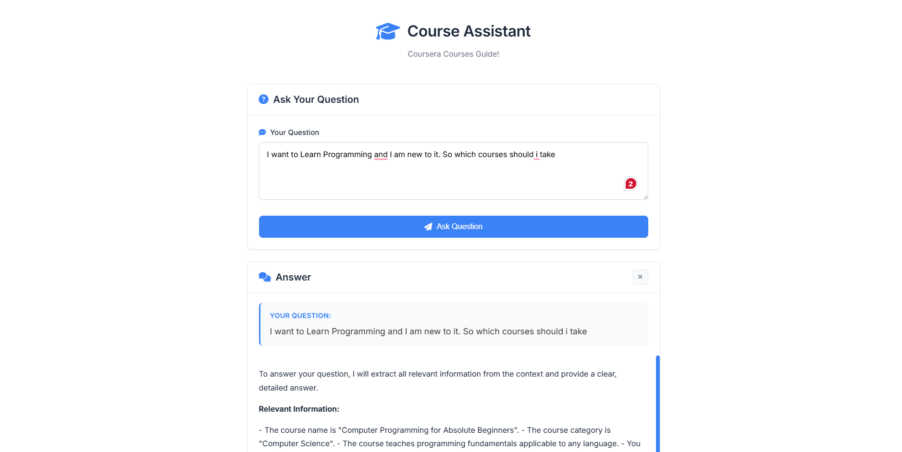

# RAG Agent - Course Assistant

A powerful Retrieval-Augmented Generation (RAG) application built with Flask that provides intelligent question-answering capabilities over your document corpus. This application is designed to help users find information about courses (or any JSON-based data) through natural language queries.



## 🚀 Features

- **Natural Language Querying**: Ask questions in plain English and get comprehensive answers
- **RAG Architecture**: Combines vector search with LLM generation for accurate, context-aware responses
- **Beautiful Web Interface**: Modern, responsive UI with a clean design
- **Conversational Responses**: Answers are formatted in natural paragraphs (like ChatGPT) for better readability
- **Lazy Loading**: Memory-optimized initialization that loads the RAG system only when needed
- **Flexible Data Source**: Works with any JSON file structure - automatically adapts to your data format
- **Vector Search**: Uses ChromaDB for efficient similarity search over document embeddings
- **Fast LLM**: Powered by Groq's Llama 3.1 8B model for quick response times

## 📋 Prerequisites

- Python 3.12 or higher
- Groq API key (get one at [console.groq.com](https://console.groq.com))
- At least 4GB RAM (8GB recommended for large datasets)

## 🛠️ Installation

1. **Clone the repository**
   ```bash
   git clone <your-repo-url>
   cd RAG_Agent
   ```

2. **Create a virtual environment** (recommended)
   ```bash
   python -m venv venv
   
   # On Windows
   venv\Scripts\activate
   
   # On Linux/Mac
   source venv/bin/activate
   ```

3. **Install dependencies**
   ```bash
   pip install -r requirements.txt
   ```

4. **Set up environment variables**
   
   Create a `.env` file in the root directory:
   ```env
   GROQ_API_KEY=your_groq_api_key_here
   ```

5. **Prepare your data**
   
   Place your JSON file in the root directory (default: `courses_en.json`). The application will automatically:
   - Detect the file structure (array or object)
   - Extract relevant text fields
   - Create embeddings and build the vector database

## 🎯 Usage

### Running the Application

1. **Start the Flask server**
   ```bash
   python app_prod.py
   ```

   Or using Gunicorn (for production):
   ```bash
   gunicorn app_prod:app --bind 0.0.0.0:8000 --workers 1 --threads 4 --timeout 120
   ```

2. **Access the web interface**
   
   Open your browser and navigate to:
   ```
   http://localhost:5000
   ```

3. **Ask questions**
   
   Simply type your question in the text area and click "Ask Question". The system will:
   - Search for relevant information in your documents
   - Generate a natural, conversational answer
   - Display the response in an easy-to-read format

### Example Queries

- "What courses are available for cybersecurity?"
- "Tell me about network security courses"
- "What skills will I learn in the programming course?"
- "Which courses are suitable for beginners?"

## 📁 Project Structure

```
RAG_Agent/
├── app_prod.py              # Main Flask application
├── requirements.txt         # Python dependencies
├── courses_en.json          # Data file (your JSON data)
├── Interface.png            # Application interface screenshot
├── src/
│   ├── data_loader.py      # JSON data loading and processing
│   ├── embedding.py        # Embedding model configuration
│   ├── vectorstore.py      # ChromaDB vector store management
│   ├── search.py           # RAG search and LLM integration
│   └── opentelemetry_patch.py  # Compatibility fixes
├── templates/
│   └── index.html          # Web interface template
├── static/
│   ├── style.css           # Styling
│   └── script.js           # Frontend JavaScript
└── chroma_db/              # Vector database (auto-generated)
```

## 🔧 Configuration

### Changing the Data Source

Edit `src/data_loader.py` and modify the `JSON_FILE_PATH`:

```python
JSON_FILE_PATH = os.path.join(os.path.dirname(os.path.dirname(__file__)), "your_file.json")
```

The collection name is automatically derived from the JSON filename.

### Customizing the LLM Model

In `src/search.py`, you can change the Groq model:

```python
self.llm = ChatGroq(groq_api_key=groq_api_key, model_name="llama-3.1-70b-versatile")
```

Available models:
- `llama-3.1-8b-instant` (default, fastest)
- `llama-3.1-70b-versatile` (more capable)
- `mixtral-8x7b-32768` (alternative)

### Adjusting Embedding Model

In `src/search.py`, modify the embedding model:

```python
RAGSearch(embedding_model="all-mpnet-base-v2")  # Larger, more accurate
```

## 🌐 API Endpoints

### `POST /api/query`
Submit a question and get an answer.

**Request:**
```json
{
  "question": "What courses are available?"
}
```

**Response:**
```json
{
  "success": true,
  "question": "What courses are available?",
  "answer": "Based on the provided context..."
}
```

### `GET /health`
Health check endpoint (doesn't require RAG initialization).

### `GET /ready`
Readiness check (verifies RAG agent is initialized).

### `GET /debug`
Debug information about the system status.

## 🏗️ Architecture

### RAG Pipeline

1. **Data Loading**: JSON files are loaded and parsed into document chunks
2. **Embedding**: Text chunks are converted to vectors using HuggingFace embeddings
3. **Vector Storage**: Embeddings are stored in ChromaDB for fast similarity search
4. **Query Processing**: 
   - User question is embedded
   - Similar documents are retrieved from the vector store
   - Retrieved context is passed to the LLM
5. **Answer Generation**: LLM generates a natural language answer based on the context

### Key Components

- **ChromaVectorStore**: Manages vector embeddings and similarity search
- **RAGSearch**: Orchestrates the search and generation pipeline
- **Data Loader**: Handles JSON parsing and document creation
- **Flask App**: Provides the web interface and API endpoints

## 🎨 Features in Detail

### Natural Paragraph Formatting
The application is configured to provide answers in natural, flowing paragraphs rather than structured blocks or bullet points, making it feel more conversational and easier to read.

### Memory Optimization
- Lazy initialization: RAG system loads only when first query is received
- Efficient embedding model: Uses lightweight `all-MiniLM-L6-v2` model
- Memory cleanup: Automatic garbage collection and CUDA cache clearing

### Flexible Data Handling
The data loader automatically detects:
- Array-based JSON structures
- Object-based JSON structures
- Nested fields and extracts relevant text content

## 🐛 Troubleshooting

### "No relevant documents found"
- Ensure your JSON file is in the correct location
- Check that the vector database was built successfully (check `chroma_db/` directory)
- Verify your JSON structure is supported

### Memory Errors
- Reduce `chunk_size` in `vectorstore.py`
- Use a smaller embedding model
- Ensure you have at least 4GB free RAM

### API Key Issues
- Verify your `.env` file contains `GROQ_API_KEY`
- Check that the API key is valid and has credits

## 📝 License

See [LICENSE](LICENSE) file for details.

## 🤝 Contributing

Contributions are welcome! Please feel free to submit a Pull Request.

## 📧 Support

For issues and questions, please open an issue on the repository.

---

**Built with ❤️ using Flask, LangChain, ChromaDB, and Groq**
